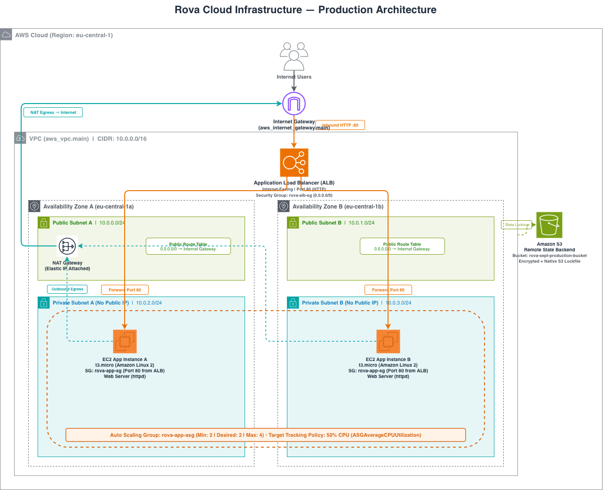

# Task 1 - Infrastructure as Code

This directory contains the Terraform configuration used to deploy a high-availability, multi-AZ web application architecture on AWS.

---

## Overview & Tool Choices

### Why Terraform?
I used **Terraform** with the latest AWS Provider (v6.x) to manage the infrastructure. Terraform is the industry standard for cloud infrastructure because of its state management, clear planning (`terraform plan`), and wide provider support.

For state locking, I configured an S3 backend with native state locking (`use_lockfile = true`). In earlier Terraform versions, S3 backends required a DynamoDB table for distributed locking. With modern Terraform, S3 natively handles lockfiles, which eliminates the extra DynamoDB table, simplifies the backend configuration, and reduces cloud costs.

---

## Architecture

The infrastructure runs in `eu-central-1` (Frankfurt) spanning two Availability Zones (`eu-central-1a` and `eu-central-1b`):



### Key Components

* **VPC & Subnets (`vpc.tf`):**
  * One VPC with CIDR `10.0.0.0/16`.
  * **2 Public Subnets** (`10.0.0.0/24`, `10.0.1.0/24`) with the Application Load Balancer and the NAT Gateway.
  * **2 Private Subnets** (`10.0.2.0/24`, `10.0.3.0/24`) with the EC2 instances.
  * **1 Internet Gateway** attached to the VPC for public ingress/egress.
  * **1 NAT Gateway** with an Elastic IP in Public Subnet A to give private instances outbound internet access. Used one EIP to reduce cost here.

* **Security Boundaries (`security.tf`):**
  * `rova-alb-sg`: Allows public inbound HTTP on port 80 (`0.0.0.0/0`) and unrestricted outbound traffic.
  * `rova-app-sg`: Allows inbound HTTP on port 80 **only from the ALB security group**. No public IP can reach instances directly. Outbound traffic is open so instances can download updates through the NAT Gateway.

* **Load Balancing (`alb.tf`):**
  * An internet-facing Application Load Balancer (`rova-alb`) distributed across both public subnets.
  * Target group (`rova-app-tg`) performing HTTP health checks with a 5-second timeout and 3-attempt thresholds.

* **Auto Scaling Group & Launch Template (`asg.tf`):**
  * Launch Template using Amazon Linux 2 (`t3.micro`) configured with user data that installs Apache (`httpd`) and injects the dynamic instance ID and AZ via IMDSv2 tokens into a branded HTML page.
  * Auto Scaling Group (`rova-app-asg`) spanning both private subnets with capacity limits: **Min: 2, Desired: 2, Max: 4**.
  * Health check type is set to `ELB` with a 300-second grace period so unhealthy instances are replaced automatically.
  * Target tracking scaling policy on `ASGAverageCPUUtilization` set to **50%**.

---

## Setup & How to Deploy

### Prerequisites
* **AWS CLI** installed and configured (`aws configure` or `export AWS_PROFILE="<profile>"`).
* **Terraform CLI** (`>= 1.10.0`).

### Required Credentials
```bash
export AWS_REGION="eu-central-1"

# Use either of the below
export AWS_ACCESS_KEY_ID="<your-access-key>"
export AWS_SECRET_ACCESS_KEY="<your-secret-key>"

# Or if you use an AWS profile:
export AWS_PROFILE="<your-profile>"
```

---

### Step-by-Step Deployment

1. **Configure Variables:**
   ```bash
   vim terraform.tfvars
   ```
   Edit `terraform.tfvars` if you want to customize the `project`, `environment`, or `owner` tags.

2. **Initialize:**
   If you haven't created the remote S3 bucket yet, validate the code locally without the backend:
   ```bash
   terraform init -backend=false
   terraform validate
   ```

   To use the S3 backend, create your S3 bucket first, then initialize:
   ```bash
   aws s3 mb s3://rova-sept-production-bucket --region eu-central-1
   terraform init
   ```

3. **Plan and Apply:**
   ```bash
   terraform plan
   terraform apply
   ```

4. **Verify Application:**
   Once the deployment finishes, print the outputs:
   ```bash
   terraform output resource_output
   ```
   Open the `application_load_balancer_dns_name` in your browser. Refresh the page or open it in another browser to see requests balance between instances in `eu-central-1a` and `eu-central-1b`.

---

## Design Decisions & Trade-Offs

* **Raw Resources over Pre-packaged Modules:**
  * I wrote direct AWS resources (`aws_vpc`, `aws_subnet`, `aws_lb`, etc.) rather than pulling in community modules. Pre-made modules are fast, but they hide route tables, subnet associations, and security group rules. Writing raw resources makes the network topology completely transparent for review.
* **Single NAT Gateway vs Multi-AZ NAT Gateways:**
  * I deployed 1 NAT Gateway in Public Subnet A and routed both private subnets through it. In an enterprise production deployment, you would run 1 NAT Gateway per AZ for complete egress redundancy. Here, using a single NAT Gateway keeps AWS running costs down (~$0.045/hr per NAT) while still giving private instances outbound internet access.
* **Decoupled HTML Application:**
  * Rather than hardcoding HTML inside the Terraform HCL or user-data script, I kept the web page in [`app/index.html`](app/index.html) and templated it into the bootstrap script. This cleanly separates application code from infrastructure provisioning.
* **Target Tracking vs Step Scaling:**
  * Target tracking dynamically adjusts capacity based on average CPU utilization (50%). This avoids manual threshold calculations and prevents rapid scale-in/scale-out.

---

## Assumptions

* Deployment region is `eu-central-1` (Frankfurt).
* Port 80 HTTP is used so the reviewer can test the ALB immediately without needing a custom domain name or public ACM certificate.
* Free-tier eligible `t3.micro` instances are sufficient for demonstration purposes.
* All resources are tagged with `project: rova`, `environment: production`, and `owner: infrastructure-team`.

---

## Teardown & Cleanup

To destroy all provisioned infrastructure and stop incurring AWS costs:

```bash
terraform destroy -auto-approve
```
